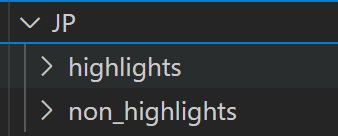
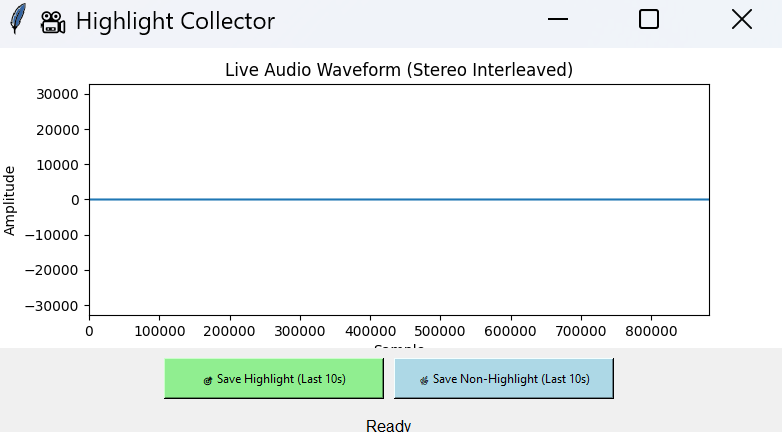

# Version 2 Documentation

## Audio Scraping

1. Download the ffmpeg from https://ffmpeg.org/download.html
2. In utils.ffmpeg.py change the ffmpeg path to where you downloaded ffmpeg - for me it looks like:
   ```
   self.ffmpeg_path = r"C:\Users\joelp\OneDrive - Cal Poly\CalPoly\CSC 566\ffmpeg\ffmpeg\bin"
   ```
3. From the repo home directory run
   ```
   python -m dataset_scraping.audio_scraping
   ```
4. Go to dataset_scraping.audio_scraping.py and change your name and go to the save_clip function. Change your name to be unique so we don't overwrite other folders. Then create a folder structure in dataset_scraping
   
5. A Tkinter GUI will pop up with a button to save a non-highlight or highlight. This should be recording computer audio not your mic. (Tested on Windows not Mac yet)
   
6. Watch sports and record what you think is a highlight. It should save the clip to the respective folder.
7. Test the audio to see if its being saved correctly. If so we can repeat and hopefully get a decently sized dataset.

## Model Prediction
