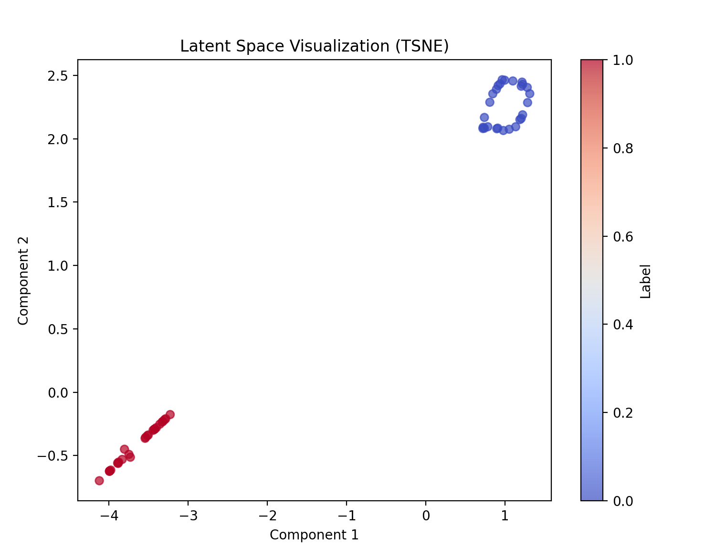
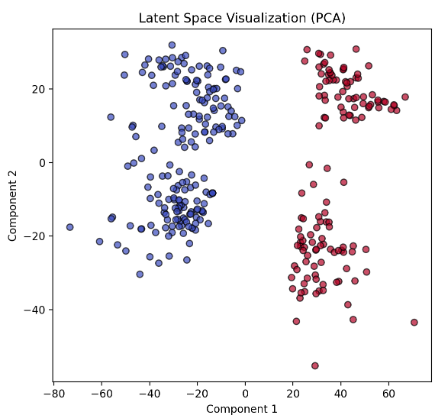
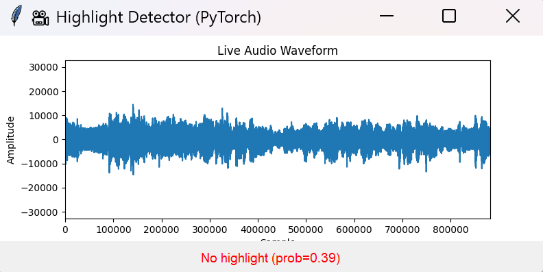
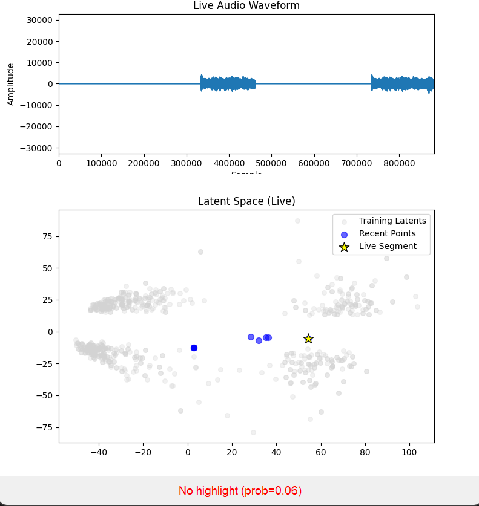

# 🏀 NBA Highlight Audio Classifier

This project classifies short NBA game audio clips as **highlight** or **non-highlight** moments using audio features, CNNs, and various neural architectures including PCA, VAE, and denoising autoencoders. It also includes tools for scraping audio clips live from your computer and predicting highlights in real-time.

---

## 📁 Directory Structure

```
.
├── dataset_scraping/
│   ├── JP/
│   ├── TV/
│   └── audio_scraping.py        # Script to scrape and process audio clips
├── highlight_env/               # Python virtual environment (optional)
├── model_v1/
│   ├── highlight_classifier.py  # Initial highlight classification model using PCA + CNN
│   ├── model_state.pth          # Saved model weights
├── model_v2/
│   ├── ablation.py              # Experiments for model analysis
│   ├── model.py                 # CNN without PCA
│   ├── model2.py                # VAE + classifier loss
│   ├── model3.py                # Denoising Autoencoder + classifier loss
│   ├── predicter.py             # Live prediction from computer audio
│   ├── model_state.pth
│   ├── vae_model_state.pth
│   ├── trained_pca.pkl
│   └── training_latents.npz
├── NBAHighlightsWAV/            # Folder of 27 highlight `.wav` clips
├── NBANonHighlightsWAV/         # Folder of 27 non-highlight `.wav` clips
└── utils/
    ├── __init__.py
    └── ffmpeg.py                # Helper for recording computer audio via ffmpeg
```

---

## 🔍 Project Overview

- **Goal**: Classify NBA game commentary clips into **highlight** or **non-highlight** segments.
- **Input**: `.wav` clips (typically 5–10 seconds).
- **Output**: `1` for highlight, `0` for non-highlight`.

---

## 🧠 Model Architectures and Training Pipeline

### 🔹 Audio Preprocessing

- All audio is trimmed or padded to a uniform 5 seconds.
- Mel spectrograms are computed using `librosa` and converted to log-scaled dB images.

### 🔹 Dimensionality Reduction and CNN (Initial Approach)

- Spectrograms are flattened and reduced to 36 dimensions using PCA.
- Reshaped into `6×6` grayscale images.
- Input to a basic CNN:
  - Conv2D (3×3), MaxPooling (2×2)
  - Flatten → Dense → Sigmoid
- Trained for 30 epochs on 80/20 train-test split.

### 🔹 Advanced Architectures

#### `model.py` — Deep CNN (No PCA)

- Skips PCA, uses full spectrograms.
- Deeper convolutional layers.
- Performance is sensitive to dataset size.

#### `model2.py` — VAE + Classifier Loss

- Uses a Variational Autoencoder to compress audio into a latent space.
- Applies classification loss on top of the latent representation.
- Helps separate class clusters in latent space.



#### `model3.py` — Denoising Autoencoder + Classifier

- Adds noise to input to encourage robustness in encoding.
- More stable and generalizable latent embeddings.

## 

## 🎤 Real-Time Highlight Prediction

The `predicter.py` script uses ffmpeg to record your computer's audio (not microphone), classifies it, and shows the live prediction alongside the training latent space.

To run:

```bash
python -m model_v2.predicter
```

Example output:




---

## 🎧 Audio Scraping Instructions

To build your dataset with custom highlight clips:

1. Download `ffmpeg` from https://ffmpeg.org/download.html
2. Set the path in `utils/ffmpeg.py`:
   ```python
   self.ffmpeg_path = r"C:\path\to\ffmpeg\bin"
   ```
3. Run the audio scraper GUI:
   ```bash
   python -m dataset_scraping.audio_scraping
   ```
4. Change your name in `save_clip()` so clips are saved to your folder.
5. Click buttons in the GUI to save clips labeled as highlight or non-highlight:

   

---

## ✅ Setup Instructions

### 1. Create and activate a virtual environment

```bash
python3 -m venv highlight_env
source highlight_env/bin/activate
```

### 2. Install dependencies

```bash
pip install torch torchvision torchaudio
pip install librosa numpy matplotlib scikit-learn
```

Or:

```bash
pip install -r requirements.txt
```

---

## 🚀 Run the Highlight Classifier (Basic)

Make sure the following are populated:

- `NBAHighlightsWAV/` with 27 highlight `.wav` clips
- `NBANonHighlightsWAV/` with 27 non-highlight `.wav` clips

Then:

```bash
python model_v1/highlight_classifier.py
```

---

## 📊 Output

- Console will print:
  - Training and validation accuracy
  - Final test accuracy
  - Classification report and confusion matrix

---

## 📌 Additional Notes

- PCA is only used in the initial model version for dimensionality reduction.
- All advanced models work directly with full or encoded spectrograms.
- Latent representations can be visualized and used for analysis.
- Easily swappable architecture to traditional ML classifiers if desired.
